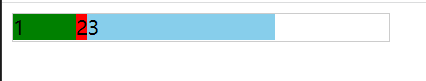

# flex布局基础到进阶

## 一、 基本概念

 flexbox，是一种一维的布局模型。它给 flexbox 的子元素之间提供了强大的**空间分布和对齐能力。**

一维布局指一次只能处理一个维度的布局，如一行或者一列。

### 1. 两根轴线

- 主轴：由`flex-direction`指定：行和列，正反方向四个值
  
  - `row`
  
  - `row-reverse`
  
  - `column`
  
  - `column-reverse`

- 交叉轴：垂直于主轴

### 2.方向问题

flexbox不用上下左右来描述方向，而是用起始线和终止线来描述。

### 3. flex容器

设置了`display:flex | inline-flex`的元素，子元素成为flex元素。

- 元素不会在主维度方向拉伸，但是可以缩小。

- 元素（没有指定height）被拉伸来填充交叉轴大小。

- [`flex-basis`](https://developer.mozilla.org/zh-CN/docs/Web/CSS/flex-basis) 属性为 `auto`。

- [`flex-wrap`](https://developer.mozilla.org/zh-CN/docs/Web/CSS/flex-wrap) 属性为 `nowrap`。

### 4. 简写属性flex-flow

 `flex-direction` 和 `flex-wrap` 组合为简写属性 `flex-flow`，如`flex-flow: row wrap;`

### 5. 核心flex属性

`flex`属性是三个属性的简写：

```css
flex: flex-grow flex-shrink flex-basis
```

1. flex-basis
- 默认值：auto 

- 用于指定元素的基础空间大小，flex容器中除元素所占的空间称为可用空间 (availlable space)。

- 元素没有设置尺寸时采用其内容尺寸。
2. flex-grow
- 默认值：0 ，即不分配可用空间。

- 如果指定了flex-grow，那么元素将按照指定比例来分配容器空间，忽略自身原始的空间大小（width）
3. flex-shrink
- 默认值：1

- 指定了flex元素的收缩规则，仅在默认宽度之和大于容器宽度时触发压缩，数值越大压缩比例越大。

## 二、详解flex属性的三个值

### 1.positive | negative free space

了解这部分内容之前首先得弄清楚两个概念：

- positive free space

- negative free space

在未进行分配空间之前，flex子项的初始宽度之和如果小于flex容器的宽度，那么就会出现 positive free space 。比如：（为了方便查看，给子项添加了颜色，容器添加了边框）

```html
<div class="container" style="width: 300px">
    <div class="box1" style="width: 50px">1</div>
    <div class="box2" style="">2</div>
    <div class="box3" style="width: 150px">3</div>
</div>
```

效果是这样的：



此时容器中空白的部分就是positive free space。

而negative free space相反，在未进行分配空间之前，flex子项的初始宽度之和如果大于flex容器的宽度，那么大于的这部分空间称为negative free space

### 2. flex-basis

默认值为0，也可以设置为content。

- 没有设置flex-basis时，元素宽度为设置的`width`，没有设置`width`则按表现出`width: max-content`的行为。

- 设置了flex-basis时则忽略设置的`width`（如果有设置的话）。

- `flex-basis`值为content的话元素大小为内容大小。

### 3.flex-grow

指定当positive free space分配时,flex子元素相对于flex容器中的其余flex子元素的增长程度.

### 4. flex: 1 1 0 、 flex: 1 1 auto 、 flex: 1

flex: 1 1 auto 表现如下如图：


flex: 1 1 0表现如下图：


**注意：`flex:1`相当于`flex: 1 1 0`**

### 5. flex-shrink

指定了**flex 缩小值**, 它确定在分配negative free space时，flex子元素相对于flex容器中其余flex子元素收缩的程度.

未完待续。。。
