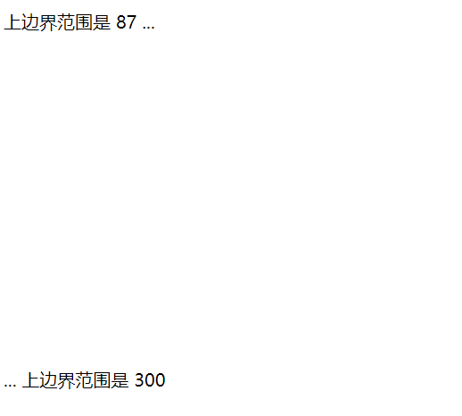
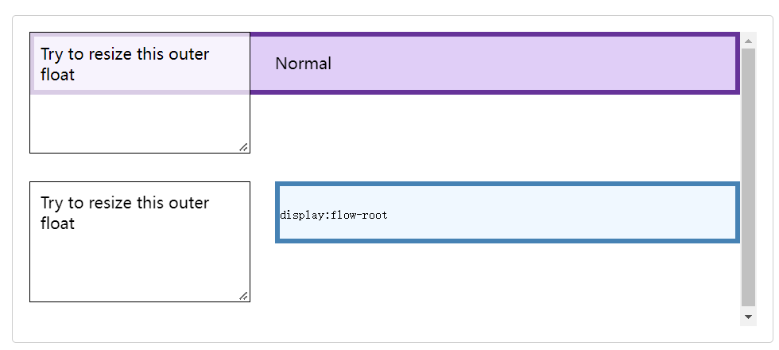

# 盒子模型

## 标准盒模型与IE盒模型

css盒模型由4个部分组成：

- content

- padding

- border

- margin

盒模型分为两种

- 标准盒模型：`width = content`

- IE盒模型：`width = content + padding + border`，也叫替代盒模型

## box-sizing

box-sizing属性定义了如何计算一个元素的width和height，它有两个取值：

- `content-box`  是默认值。
- `border-box` 告诉浏览器：你想要设置的边框和内边距的值是包含在width内的。

## 外边距重叠

块的上边距和下边距有时候会合并成两者中大的那个边距，这就是边距折叠。

有3中出现外边距重叠的情况：

1. 上下相邻元素

2. 没有内容将父元素和后代元素分开

如果没有边框[`border`](https://developer.mozilla.org/zh-CN/docs/Web/CSS/border)，内边距[`padding`](https://developer.mozilla.org/zh-CN/docs/Web/CSS/padding)，行内内容，也没有创建[块级格式上下文](https://developer.mozilla.org/zh-CN/docs/Web/Guide/CSS/Block_formatting_context)或[清除浮动](https://developer.mozilla.org/zh-CN/docs/Web/CSS/clear)来分开一个块级元素的上边界[`margin-top`](https://developer.mozilla.org/zh-CN/docs/Web/CSS/margin-top) 与其内一个或多个后代块级元素的上边界[`margin-top`](https://developer.mozilla.org/zh-CN/docs/Web/CSS/margin-top)；或没有边框，内边距，行内内容，高度[`height`](https://developer.mozilla.org/zh-CN/docs/Web/CSS/height)，最小高度[`min-height`](https://developer.mozilla.org/zh-CN/docs/Web/CSS/min-height)或 最大高度[`max-height`](https://developer.mozilla.org/zh-CN/docs/Web/CSS/max-height) 来分开一个块级元素的下边界[`margin-bottom`](https://developer.mozilla.org/zh-CN/docs/Web/CSS/margin-bottom)与其内的一个或多个后代后代块元素的下边界[`margin-bottom`](https://developer.mozilla.org/zh-CN/docs/Web/CSS/margin-bottom)，则就会出现父块元素和其内后代块元素外边界重叠，重叠部分最终会溢出到父级块元素外面。

3. 空的块级元素

这个就有点amazing了，直接看看下面的demo

```html
<!DOCTYPE html>
<html lang="en">
    <head>
        <meta charset="UTF-8" />
        <meta http-equiv="X-UA-Compatible" content="IE=edge" />
        <meta name="viewport" content="width=device-width, initial-scale=1.0" />
        <title>Document</title>
        <style>
            ​​​​​​p {
                margin: 0;
            }
            div {
                margin-top: 13px;
                margin-bottom: 300px;
            }
        </style>
    </head>
    <body>
        <p>上边界范围是 87 ...</p>
        <div></div>
        <p>... 上边界范围是 300</p>
    </body>
</html>
```

看看结果：



注意：

- 即使某一外边距为0，这些规则仍然适用。因此就算父元素的外边距是0，第一个或最后一个子元素的外边距仍然会“溢出”到父元素的外面。
- 如果参与折叠的外边距中包含负值，折叠后的外边距的值为最大的正边距与最小的负边距（即绝对值最大的负边距）的和,；也就是说如果有-13px 8px 100px叠在一起，边距就是 100px -13px的87px。
- 如果所有参与折叠的外边距都为负，折叠后的外边距的值为最小的负边距的值。这一规则适用于相邻元素和嵌套元素。

## BFC

**BFC(Block Formatting Context)**：块级格式化上下文。  

简单理解：一个BFC就是一个单独的可视化绘制区域，不同的BFC之间不会相互影响。

### BFC的渲染规则

1. BFC元素垂直方向的边距会发生重叠。属于不同BFC外边距不会发生重叠
2. BFC的区域不会与浮动元素的布局重叠。
3. BFC元素是一个独立的容器，外面的元素不会影响里面的元素。里面的元素也不会影响外面的元素。
4. 计算BFC高度的时候，浮动元素也会参与计算(清除浮动)

### 如何创建BFC

1. html根元素本身就是一个BFC

2. 设置定位:`absolute | sticky | fixed`

3. 设置浮动`float`

4. 设置`display:flex`

5. 设置`display: grid`

6. 表格单元格或表格标题，设置了`table-*`属性的元素

7. 块级元素可以设置`overflow`不为`visible`，通常设置为`auto`，不过该属性是用于告诉浏览器如何处理溢出元素部分，所以仅仅用使用该方法来创建一个BFC可能会导致出现滚动条或剪切阴影等问题。

8. 使用`display: flow-root`显式创建BFC，`flow-root` 关键字的意义是，创建的内容本质上类似于一个新的根元素（如html所做），并确定这个新的上下文如何创建及其流布局如何实现。使用这个属性不会产生任何其他副作用。

## BFC的应用

1. 包含内部浮动

当父容器不是BFC时，子元素设置浮动且高度大于父容器，这时子元素就会穿出父容器，此时将为父容器创建一个BFC就可以将子元素包裹起来。

2. 解决外边距重叠问题

3. 排除外部浮动

正常文档流中建立的 BFC 不得与元素本身所在的块格式化上下文中的任何浮动的外边距重叠。简单来收就是BFC之间不会重叠在一起。看个MDN的例子：

```html
<section>
  <div class="float">Try to resize this outer float</div>
  <div class="box"><p>Normal</p></div>
</section>
<section>
  <div class="float">Try to resize this outer float</div>
  <div class="box" style="display:flow-root"><p><code>display:flow-root</code><p></div>
</section>
```

```css
section {
  height:150px;
}
.box {
  background-color: rgb(224, 206, 247);
  border: 5px solid rebeccapurple;
}
.box[style] {
  background-color: aliceblue;
  border: 5px solid steelblue;
}
.float {
  float: left;
  overflow: hidden; /* required by resize:both */
  resize: both;
  margin-right:25px;
  width: 200px;
  height: 100px;
  background-color: rgba(255, 255, 255, .75);
  border: 1px solid black;
  padding: 10px;
}
```


