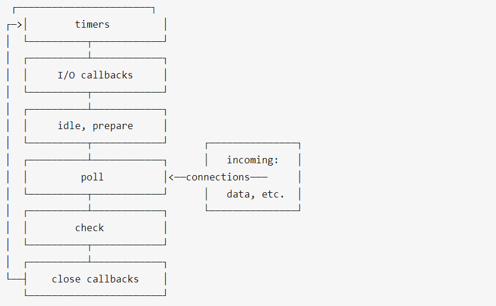

# JavaScript时间循环机制

## 什么是事件循环？

JS引擎是**单线程**的，直白来说就是一个时间点下JS引擎只能去做一件事情，而Java这种多线程语言，可以同时做几件事情。

JS做的任务分为**同步**和**异步**两种，所谓 "异步"，简单说就是一个任务不是连续完成的，先执行第一段，等做好了准备，再回过头执行第二段，第二段也被叫做回调；同步则是连贯完成的。

- 举例：像**读取文件**、**网络请求**这种任务属于异步任务：花费时间很长，但中间的操作不需要JS引擎自己完成，它只用等别人准备好了，把数据给他，他再继续执行回调部分。如果没有特殊处理，JS引擎在执行异步任务时，应该是存在等待的，不去做任何其他事情。

js采取了**异步任务回调通知**的模式

- 在等待异步任务准备的同时，JS引擎去执行其他同步任务，等到异步任务准备好了，再去执行回调。这种模式的优势显而易见，完成相同的任务，花费的时间大大减少，这种方式也被叫做**非阻塞式**。
- 而实现这个“通知”的，正是**事件循环**，把异步任务的回调部分交给事件循环，等时机合适交还给JS线程执行。事件循环并不是JavaScript首创的，它是计算机的一种运行机制。
- 事件循环是由一个队列组成的，异步任务的回调遵循先进先出，在JS引擎空闲时会一轮一轮地被取出，所以被叫做循环。
- 根据队列中任务的不同，分为宏任务和微任务。

## 宏任务和微任务

当同步代码执行完毕，查看微任务队列是否有任务，有的话就先把微任务队列中的任务执行完，没有的话就取一个宏任务来执行，执行完毕后又去看微任务队列有没有任务，如此构成了一个循环。

宏任务：

- script（整体代码）

- setTimout / setInterval

- setImmediate(node 独有)

- requestAnimationFrame(浏览器独有)

- IO

- UI render（浏览器独有）

微任务

- process.nextTick(node 独有)

- Promise.then()

- Object.observe

- MutationObserver

## 浏览器的事件循环

- 浏览器的事件循环由**一个宏任务队列**+**多个微任务队列**组成。
  
  - 宏任务队列只有一个，而每一个宏任务都有一个自己的微任务队列，每轮循环都是由一个宏任务+多个微任务组成。

- 首先，执行第一个宏任务：全局Script脚本。产生的的宏任务和微任务进入各自的队列中。执行完Script后，把当前的微任务队列清空。完成一次事件循环。

- 接着再取出一个宏任务，同样把在此期间产生的回调入队。再把当前的微任务队列清空。以此往复。

- 下面的Demo展示了微任务的插队过程：

```js
Promise.resolve().then(() => {
  console.log('第一个回调函数：微任务1')
  setTimeout(() => {
    console.log('第三个回调函数：宏任务2')
  }, 0)
})
console.log(1)
setTimeout(() => {
  console.log('第二个回调函数：宏任务1')
  Promise.resolve().then(() => {
    console.log('第四个回调函数：微任务2')
  })
}, 0)
console.log(2)
// 第一个回调函数：微任务1
// 第二个回调函数：宏任务1
// 第四个回调函数：微任务2
// 第三个回调函数：宏任务2

//先执行整体代码，然后检查微任务队列，然后取一个宏任务并执行，然后检查并执行完微任务队列所有任务，然后取一个宏任务并执行，循环往复
```

## node事件循环

在node中，事件循环表现出的状态与浏览器中大致相同。不同的是node中有一套自己的模型。node中事件循环的实现是依靠的**libuv引擎。**

node选择**chrome v8引擎作为js解释器**，v8引擎将js代码分析后去调用对应的node api，而这些api最后则由libuv引擎驱动，执行对应的任务，并把不同的事件放在不同的队列中等待主线程执行。 因此实际上node中的事件循环存在于libuv引擎中。

libuv引擎的事件循环模型：



1. poll轮询阶段
- 先查看poll queue中是否有事件，有任务就按先进先出的顺序依次执行回调。

- 当queue为空时，会检查是否有**setImmediate()的callback**，如果有就进入check阶段执行这些callback。执行数会受到node的限制，不会无限执行下去。

- 同时也会检查是否有到期的timer，如果有，就把这些到期的timer的callback按照调用顺序放到timer queue中，之后循环会进入timer阶段执行queue中的 callback。

- 这两者的顺序是不固定的，受到到代码运行的环境的影响。如果两者的queue都是空的，那么loop会在poll阶段停留，直到有一个i/o事件返回，循环会进入i/o callback阶段并立即执行这个事件的callback。
2. check阶段

专门用来执行`setImmediate()`方法的回调。

3. close阶段

当一个socket连接或者一个handle被突然关闭时（例如调用了`socket.destroy()`方法），close事件会被发送到这个阶段执行回调。否则事件会用`process.nextTick（）`方法发送出去。

4. timer阶段

执行setTimeout或者setInterval函数设置的回调函数。

5. I/O Callback

执行I/O事件的回调。

## process.nextTick()

实际上node中存在着一个特殊的队列，即nextTick queue。

这个队列中的回调会在每次进入新阶段前优先执行，直到该队列清空，因此错误使用process.nextTick()可能导致死循环直到内存溢出。

## setImmediate()

字面意思表示立即执行，实际却是在特点阶段即poll阶段执行。

```js
setTimeout(() => {
    console.log('timeout');
}, 0);

setImmediate(() => {
    console.log('immediate');
});
```

上面的代码执行顺序无法确定，但是在I/O事件的回调中顺序是固定的。

```js
const fs = require('fs');

fs.readFile(__filename, () => {
    setTimeout(() => {
        console.log('timeout');
    }, 0);
    setImmediate(() => {
        console.log('immediate');
    });
});


// immediate
// timeout
```

**记住：在I/O事件的回调中，setImmediate方法的回调永远在timer的回调前执行。**


