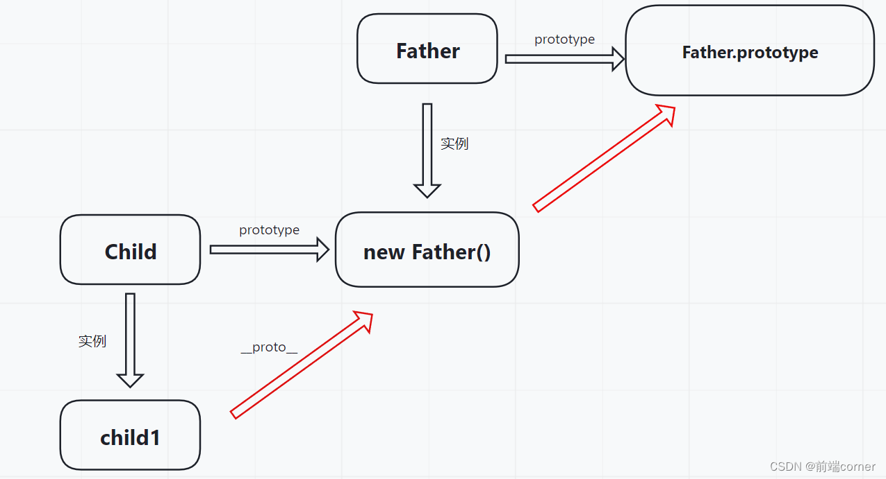

@[TOC](javascript多种继承方式及其优缺点)

# 前言

> 本文介绍了javascript中多种继承方式及其优缺点，读完本文将收获：
> 
> - 知道javascript中6种继承方式的实现原理
> - 知道各种继承方式的优缺点
> - 理解各种继承方式之间的联系

# 一、原型链继承

顾名思义，原型链继承利用了构造函数的原型对象来实现继承。如下代码中有两个类，子类Child想要继承父类Father的name属性该怎么做？

```javascript
function Father(){
    this.name = 'William'
}
function Child(){
}
```

每一个构造函数都有一个`prototype`属性，它指向构造函数的原型对象。我们可以让子类构造函数的`prototype`属性等于父类的一个实例，即：

```javascript
Child.prototype = new Father()
```

然后我们生成一个子类的实例，并且去访问子类实例的`name`属性：

```javascript
let child1 = new Child()
console.log(child1.name)    // Willam
```

可以看到打印出`William`，访问child1的name属性的工作机制是这样的：

- 查找`child1`自身发现没有name属性
- 查找`child1.__proto__`属性指向的对象，该对象也就是`Child.prototype`指向的对象，它是父类`Father`的一个实例，查找该对象，发现有`name`属性，于是返回。
  用一个图来表示上面的关系：
  
  
  途中红色箭头部分就是所谓的原型链，利用原型链我们也可以实现方法的继承，如下所示：

```javascript
Father.prototype.getName = function () {
    console.log(this.name)
}
child1.getName()  // william
```

<br>
上面示例的整体代码：

```javascript
function Father() {
    this.name = 'Willam'
}

Father.prototype.getName = function () {
    console.log(this.name)
}

function Child() {}

Child.prototype = new Father()

let child1 = new Child()

console.log(child1.name)
child1.getName() // william
```

利用原型链实现继承简单直观，那么修改子类实例的属性会怎样呢？

```javascript
let child2 = new Child()
console.log(child2.name)    // William
console.log(child1.name)    // William
child2.name = 'Jane'
console.log(child2.name)    // Jane
console.log(child1.name)    // William
```

看上面代码似乎没有问题，实例之间的属性并没有相互影响，那是因为这里是直接给`child2`增加了一个自身的`name`属性，而不是去修改它继承的那个属性：

```javascript
console.log(child2.__proto__.name)    // William
```

如果所继承的属性是引用类型，那修改实例属性时就需要注意了：

```javascript
function Father() {
    this.names = ['William']
}
function Child() {}
Child.prototype = new Father()

let child1 = new Child()
let child2 = new Child()

console.log(child1.names) // [ 'William' ]
console.log(child2.names) // [ 'William' ]

child1.names.push('Jane')

console.log(child1.names) // [ 'William', 'Jane' ]
console.log(child2.names) // [ 'William', 'Jane' ]
```

# 二、借用构造函数（经典继承）

直接在子类构造函数中调用父类构造函数并改变其this指向。

```javascript
function Father() {
    this.names = ['William', 'Jane']
    this.getName = function () {
        console.log(this.names)
    }
}

function Child() {
    Father.call(this)
}

let child1 = new Child()
let child2 = new Child()

console.log(child1.names) // [ 'William', 'Jane' ]
console.log(child2.names) // [ 'William', 'Jane' ]
child1.getName()  // [ 'William', 'Jane' ]
child2.getName()  // [ 'William', 'Jane' ]

child1.names.pop()

console.log(child1.names) // [ 'William' ]
console.log(child2.names) // [ 'William', 'Jane' ]
child1.getName()  // [ 'William' ]
child2.getName()  // [ 'William', 'Jane' ]
```

优点：

- 子类实例的方法和属性都是独有的
- 可以向父类构造函数传参，举个例子

```javascript
function Father(name) {
    this.name = name
}

function Child(name) {
    Father.call(this, name)
}

let child1 = new Child('William')
console.log(child1.name)  // William
```

缺点：

- 在每一次创建子类实例时，继承的方法总是要被重新创建。

# 三、组合继承

组合继承是javascrip最常用的继承模式，它将一和二两种方法组合起来：

- 利用原型链继承方法
- 借助构造函数继承属性

```javascript
function Father() {
    this.names = ['William', 'Jane']
}

Father.prototype.getNames = function () {
    console.log(this.names)
}

function Child() {
    Father.call(this)
}
Child.prototype = new Father()
Child.prototype.constructor = Child

let child1 = new Child()
let child2 = new Child()

console.log(child1.names) // [ 'William', 'Jane' ]
console.log(child2.names) // [ 'William', 'Jane' ]
child1.getNames() // [ 'William', 'Jane' ]
child2.getNames() // [ 'William', 'Jane' ]

child1.names.push('Amy')

console.log(child1.names) // [ 'William', 'Jane', 'Amy' ]
console.log(child2.names) // [ 'William', 'Jane' ]
child1.getNames() // [ 'William', 'Jane', 'Amy' ]
child2.getNames() // [ 'William', 'Jane' ]
```

优点：

- 子类实例的属性是独有的
- 子类实例的方法都是继承父类原型上的方法，不用每次都创建
- 创建子类实例时可以向父类构造函数传参
  缺点：
- 要调用两次父类的构造函数，效率低。且在`new Father()`创建的对象上也有并不需要的属性。

```javascript
function Child() {
    Father.call(this)    // 第一次调用
}
Child.prototype = new Father()    // 第二次调用
```

# 四、原型式继承

当我们想要在一个对象的基础之上去构造另一个对象而不想创建额外的构造函数，就非常适合使用**原型式继承**。

```javascript
function createObj(o) {
    function F() {}
    F.prototype = o
    return new F()
}

let father = {
    name: 'William',
    hobby: ['basketball', 'reading']
}

let child = createObj(father)
child.name = 'Jane'
console.log(child) // { name: 'Jane' }
console.log(child.name) // Jane
console.log(child.hobby) // [ 'basketball', 'reading' ]
```

上面的`createObj()`其实就是ES5中`Object.create()`的模拟实现，其中`Object.create`还可以接收第二个参数，它是一个对象，对象里可以定义要创建的对象独有的属性和方法。
缺点：

- 和原型链继承一样，实例的引用类型的属性都是共享的。

# 五、寄生式继承

创建一个实现继承的函数，在函数里以某种方式增强对象。

```javascript
function createObj(o) {
    let clone = Object.create(o)
    clone.sayHi = function () {
        console.log('hi')
    }
  return clone
}
```

缺点：

- 和借用构造函数的继承方式一样，每个实例都要重新创建同一方法。

# 六、寄生组合式继承

回顾一下前面使用的组合式继承

```javascript
function Father(name) {
    this.name = name
}

Father.prototype.getName = function () {
    console.log(this.name)
}

function Child(name, age) {
    Father.call(this, name)
  this.age = age
}

Child.prototype = new Father()    
```

上面代码的最后一步是为了继承父类的方法，但是`new Father()`又被调用了一次且它得到的对象上面也有name属性，而我们并不需要这些属性，我们只是需要这个对像把实例对象与`Father.prototype`对象联系起来。

所以我们可以直接创建一个对象，让这个对象的构造函数的`prototype`指向`Father.prototype`

```javascript
function Father(name) {
    this.name = name
}

Father.prototype.getName = function () {
    console.log(this.name)
}

function Child(name, age) {
    Father.call(this, name)
    this.age = age
}

// Child.prototype = new Father()

function F() {}
F.prototype = Father.prototype
Child.prototype = new F()

let child1 = new Child('William', 19)
console.log(child1.name) // William
child1.getName() // William
```

将上面的过程封装一下：

```javascript
function createObj(father){
  function F(){}
  F.prototype = father.prototype
  return new F()
}

function inheritPrototype(father , child){
  let prototype = createObj(father)
  prototype.constructor = child
  child.prototype = prototype
}

inheritPrototype(Father , Child)    // 调用的时候
```

优点：

- 只调用了一次父类构造函数且避免了新增不必要的属性，效率更高。

寄生式组合继承可以算是引用类型继承的最佳模式。

<br>

# 总结

## 🍩原型链继承：

```javascript
Child.prototype = new Father()
```

- 优点：简单直观，子类的实例方法是共享的，不用每次都创建。
- 缺点：子类实例继承的引用属性都是共享的。

## 🍩借用构造函数：

```javascript
Father.call(this)
```

- 优点：子类继承的属性不共享
- 缺点：实例的方法每次都要重新创建。

## 🍩组合继承：

```javascript
Father.call(this)

Child.prototype = new Father()
```

- 优点：子类的实例方法是共享的，不用每次都创建。子类继承的属性独有不共享。
- 缺点：调用了两次父类构造函数，且`new Father()`得到的对象上的属性我们并不需要。

## 🍩原型式继承

```javascript
function createObj(o){
    function F(){}
    F.prototype = o
    return new F()
}
```

- 优点：直接实现对象继承另一个对象而无需构造函数。
- 缺点：实例继承的属性都是共享的。

## 🍩寄生式继承

在原型式继承的基础上增强得到的对象。

- 缺点：和借用构造函数的继承方式一样，每个实例都要重新创建同一方法。

## 🍩寄生组合式继承

组合继承与寄生继承的结合

- 优点： 只调用了一次父类构造函数且避免了新增不必要的属性，效率更高。
