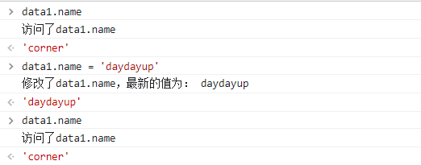

# Vue原理

## 1-数据响应式

### 实现方式

数据响应式就是一旦数据发生变化，我们可以得知这种变化并执行一些操作。

如何实现数据响应式？有两种方式：

1. 对象属性拦截（Vue2.x）

`Object.defineProperty`

2. 对象整体代理(Vue3.x)

`Proxy`

### Object.defineProperty()

该方法用于在对象上增加新属性或修改对象的现有属性。

参数：

1. 对象

2. 属性名或Symbol

3. 配置对象，包含value、writable、enumerable、configurable、get()、set()

```js
let data1 = {}
Object.defineProperty(data1, 'name', {
    // 访问data1.name是自动调用set,得到get的返回值
    get() {
        console.log('访问了data1.name')
        return 'corner'
    },
    // 修改name时调用的函数，传入新值
    set(newVal) {
        console.log('修改了data1.name，最新的值为：', newVal)
    }
})
```



可以看到，此时修该属性name后再次访问却没有改变，还是打印了`corner`，这是因为get和set之间没有任何联系。

### 联系get和set

解决上述问题的方式很简单，维护一个公共变量即可。

```js
let _name = 'corner'
let data1 = {}
Object.defineProperty(data1, 'name', {
  // 访问data1.name是自动调用set,得到get的返回值
  get() {
    console.log('访问了data1.name')
    return _name
  },
  // 修改name时调用的函数，传入新值
  set(newVal) {
    console.log('修改了data1.name，最新的值为：', newVal)
    _name = newVal
  }
})
```

上面代码通过get和set操作公共变量`_name`，这样就可以正常修改name属性了。

在Vue中我们是把响应式数据放在`data(){return {}}`返回的对象里。

```js
let data = {
  isActive: true,
  count: 0,
  arr: ['new', 'hot']
}

Object.keys(data).forEach((key) => {
  defineReactive(data, key, data[key])
})

function defineReactive(obj, key, value) {
  Object.defineProperty(obj, key, {
    get() {
      return value
    },
    set(newVal) {
      value = newVal
    }
  })
}
```

上面的代码就实现了对象的属性拦截。

**注意：**

- `Object.defineProperty()`劫持的是**对象的属性**，需要遍历属性，产生闭包，性能开销比较大。

- 基于以上原因，开发中尽量不要在data里写无用的数据。

- Vue3.x中，解决了Vue2.x中对于数据响应式处理的无端性能消耗，使用`Proxy`劫持了**对象整体**+**惰性代理**，用到了才进行响应式转换。


## 2-数据变化反映到视图


