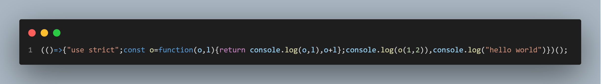

# Webpack中的tree-shaking

tree-shaking就是把js文件中无用的模块或者代码删掉。而这通常需要借助一些工具。在webpack中tree-shaking就是在打包时移除掉javascript上下文中无用的代码，，从而优化打包的结果。

在webpack5中已经自带tree-shaking功能，在打包模式为`production`时，默认开启 tree-shaking功能。

## 简单实践

使用webpack5来进行一次简单的实践。

首先创建一个文件夹作为项目的根目录，然后运行

```shell
npm init -y
```

接着安装一下webpack和webpack-cli

```shell
npm install webpack webpack-cli --save-dev
```

然后创建一个src文件夹，在里面创建两个js文件`index.js`和`utils.js`

index.js

```js
import tool from './util.js'

// 使用a变量，调用文件里面的a函数，不使用b函数
console.log(tool.add(1, 2))
console.log('hello world')

// 不可能执行的代码
if (false) {
    console.log('这是一段不可能执行的代码')
}

// 定义了但是没用的变量
const m = 1
```

utils.js

```js
function add(a, b) {
    console.log(a, b)
    return a + b
}
function count(num) {
    console.log(num)
    return num++
}
export default {
    add,
    count
}
```

配置一下package.json的启动命令：

```js
"scripts": {
    "test": "echo \"Error: no test specified\" && exit 1",
    "build": "webpack"
},
```

然后进入项目根目录，在控制台运行`npm run build`，默认的打包模式就是`production`，之后就会在根目录下生成dist文件夹，其中的main.js就是打包后的结果：



外面可以发现导入但没有使用的count函数、定义未使用的m变量还有不可能执行的代码都被shaking掉了。

## 副作用sideEffects

什么是副作用呢？这其实是针对与模块来说的，也就是一个js文件。我们说一个js文件有副作用，指的是这个js文件中有一些代码执行之后会对模块之外的代码产生影响。例如我们在js文件中进行pollify（打补丁），或者进行类似`Array.prototype.add = ...`的行为都会产生副作用。

那么针对于这些有副作用的代码，webpack会帮我们打包进来吗？如果它是一个合格的打包工具，那么我想它是会这样做的，而事实也是如此。

实践一下看看，修改一下刚刚的`util.js`文件，增加下面的代码：

```js
Array.prototype.side = function () {
    console.log('这是一段有副作用的代码')
}
```

我们在Array的原型上挂载了一个side方法，运行`npm run build`打包得到以下结果（格式化）：

```js
;(() => {
    'use strict'
    Array.prototype.side = function () {
        console.log('这是一段有副作用的代码')
    }
    const o = function (o, l) {
        return console.log(o, l), o + l
    }
    console.log(o(1, 2)), console.log('hello world')
})()
```

可以看到webpack确实帮我们打包进来了。

那么webpack是怎么判断一段代码是否有副作用的呢？原来它是借助了terser这个库。terser是一个ES6+的js解析器、处理程序和代码压缩工具，webpack正是依赖这个库进行js的解析和代码压缩。

当使用import导入一个模块时，由于ES6module的静态结构特性，webpack可以首先判断一下是否使用了导入的代码，如果没有，它会直接不导入该模块，这样就不用terser进入模块去分析里面的代码。 

如果不做额外的配置，导入一个模块但不使用用该模块导出的内容，此时webpack还是会用terser去分析该模块代码是否有副作用。

实践一下看看是不是这样。

我们修改一下`index.js`的代码，导入模块但是不使用。

```js
import tool from './util.js'

console.log('hello world')

// 不可能执行的代码
if (false) {
    console.log('这是一段不可能执行的代码')
}

// 定义了但是没用的变量
const m = 1
```

`util.js`的代码不变，如下：

```js
function add(a, b) {
    console.log(a, b)
    return a + b
}
function count(num) {
    console.log(num)
    return num++
}

Array.prototype.side = function () {
    console.log('这是一段有副作用的代码')
}
export default {
    add,
    count
}
```

打包结果：

```js
;(() => {
    'use strict'
    ;(Array.prototype.side = function () {
        console.log('这是一段有副作用的代码')
    }),
        console.log('hello world')
})()
```

不错不错，确实如此。虽然util模块被导入没有使用，但是webpack还是对该模块做了副作用的分析和评估。

那么这样会不会有上面问题呢？

设想一下有一个模块被导入了，但是我们并没有使用该模块，且我们明确地直到该模块中的代码没有副作用，是一个纯正的ES Module，但是webpack还是会对该模块进行分析评估的工作，这就导致了打包时间的增加。所以强大的webpack允许我们配置这一行为。

## sideEffects配置项

### false

webpack允许我们声明一个模块有无副作用。

如果所有模块都是纯正的，即都没有副作用，我们可以设置

```json
"sideEffects": false  
```

那么如果导入的模块没有使用，webpack就不会导入它，更不会去分析它。

怎么验证呢？我们直接在package.json文件中添加`"sideEffects": false`，然后util.js还是保留那句副作用的代码：

```js
Array.prototype.side = function () {
    console.log('这是一段有副作用的代码')
}
```

在index.js中导入util.js但是不使用。打包结果如下：

```js
;(() => {
    'use strict'
    console.log('hello world')
})()
```

可以看到那句有副作用的代码并没有被打包，说明webpack直接跳过了util模块的副作用分析。

### 数组

sideEffects配置项其实更多是用来声明需要进行副作用分析的模块的。因为在实际开发中不可能所有模块都没有副作用。

此时sideEffects的值是一个数组，数组中包含的文件告诉webpack在遇到这些模块的导入时要进行副作用的分析评估。

而没有指明的模块，在导入后如果没有被使用，那么webpack不会将它导入，更不会对他进行分析。

我们修改一下package.json中`sideEffects`的值如下：

```json
"sideEffects": [
    "**/*.css"
]
```

其他代码和之前一样，我们看看webpack会不会去分析util，结果和上面的一样，那段有副作用的代码没有被打包。

## 结论

webpack官方文档总结的已经非常好了，这里就引用一下把！

> 我们学到为了利用 *tree shaking* 的优势， 你必须...
> 
> - 使用 ES2015 模块语法（即 `import` 和 `export`）。
> - 确保没有编译器将您的 ES2015 模块语法转换为 CommonJS 的（顺带一提，这是现在常用的 @babel/preset-env 的默认行为，详细信息请参阅[文档](https://babeljs.io/docs/en/babel-preset-env#modules)）。
> - 在项目的 `package.json` 文件中，添加 `"sideEffects"` 属性。
> - 使用 `mode` 为 `"production"` 的配置项以启用[更多优化项](https://webpack.docschina.org/concepts/mode/#usage)，包括压缩代码与 tree shaking。

备注：本文参考webpack5中文文档结合自己的实践理解所写，可能会有错误，欢迎讨论。
