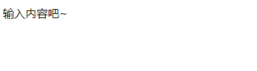
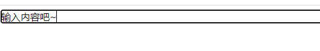
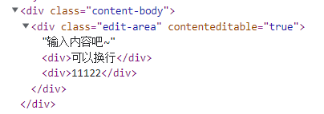

# 在线文档编辑器的基本实现原理

富文本是针对于传统意义的纯文本提出的，简单来说就是具有丰富格式的文本。那么如何在浏览器上去呈现文本和编辑文本就是要解决的两个问题。


## 呈现文本

在浏览器上呈现文本，浏览器提供的内容呈现技术大致有3种：

- HTML+CSS

- SVG

- Canvas

而HTML+CSS是三种方案里最简单的，实现相同的UI效果，它所需要的代码是最少的。


## 编辑文本

如何编辑文本呢？答案是 contenteditable属性。这是一个全局属性，表示元素是否可被用户编辑，如果可以，浏览器会相爱元素的部件以允许编辑。


**尝试一下**

新建一个html文件，在<body>里写上如下代码，给div添加`contenteditable="true"`

```html
<div class="content-body">
	<div class="edit-area" contenteditable="true">输入内容吧~</div>
</div>
```

打开浏览器查看，为聚焦时是这样的：



聚焦以后会出现黑色边框和光标：



而且还支持换行，用谷歌调试工具查看了一下发现在换行时浏览器会自动为新的行创建一个div元素:




## 其他相关的属性和方法

### 1.Document.designMode

用于控制整个文档是否可编辑，有效值为`'on'`和`'off'`，默认为`off`

### 2.Selection对象

表示用户选择的文本范围或插入符号的当前位置。它代表页面中的文本选区，可能横跨多个元素。文本选区由用户拖拽鼠标经过文字而产生。通过`window.getSelection()可以获取Selection对象`。

#### （1）Selection.anchorNode

返回选区开始位置所属的节点，是一个只读属性。

#### （2）Selection.anchorOffset

只读属性，返回选区的起始位置与起点的偏移量。例如如果选取从当行的最前面开始，那么偏移量为0。

#### （3）Selection.focusNode

返回所选内容的结束位置部分所属的节点.

#### （4）Selection.focusOffset

返回选区终点在focusNode中的偏移量

#### （5）Selection.isCollapsed

返回一个布尔值用于描述选区的起始点和终止点是否位于一个位置。

#### （6）Selection.rangeCount

返回选区(selection)中range对象数量的只读属性。默认情况下为1.

#### （7）Selection.type

返回当前选择的类型。有以下三个值：

- `None`: 当前没有选择。
- `Caret`: 选区已折叠（即 光标在字符之间，并未处于选中状态）。
- `Range`: 选择的是一个范围。
