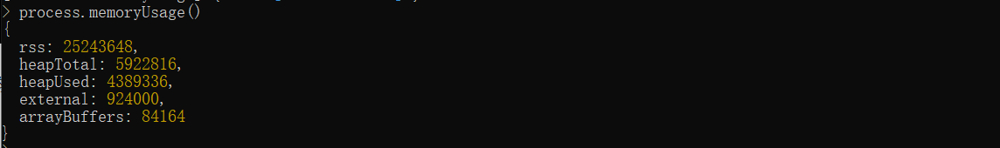

# V8引擎的垃圾回收机制

## 为什么需要垃圾回收？

在javascript代码的执行过程中，没遇到一个函数调用就会创建一个执行上下文并入执行上下文栈，该上下文中包含函数中的所有变量，在执行完该函数后，如果不及时回收其中的变量，而是让它们持久地占用内存，就会导致内存暴增，引发内存泄漏导致程序的性能直线下降。因此就需要一种垃圾回收的机制，及时将使用完后的内存归还给操作系统。

javascript不需要我们手动地进行内存释放，V8引擎会自动地进行内存的分配和管理。

## V8引擎的内存限制

默认情况下：

64位：1.4GB

32位：0.7GB

为何要限制内存大小取决于以下3点：

- V8设计之初只是作为浏览器端的js执行环境，很少会遇到使用大内存的场景，因此没有必要把内存设置太高。

- js是单线程的，主线程一次只能做一件工作，当V8引擎执行垃圾回收时会阻塞js的执行，知道垃圾回收结束才会恢复。

- 使用内存越大，完成一次垃圾回收的时间就越长，浏览器一直处于等待状态，同时失去对用户的响应，如果有动画在执行还可能出现掉帧卡顿的现象，严重影响性能。因此V8引擎采用了简单粗暴的方法：限制堆内存大小。

## node

可以使用`node --v8-options`查看关于V8的选项

```js
// 设置新生代内存中单个半空间的内存最小值，单位MB
node --min-semi-space-size=1024 xxx.js

// 设置新生代内存中单个半空间的内存最大值，单位MB
node --max-semi-space-size=1024 xxx.js

// 设置老生代内存最大值，单位MB
node --max-old-space-size=2048 xxx.js
```

`process.memoryUsage()`查看当前Node进程使用的实际内存大小。



- `heapTotal`：表示V8当前申请到的堆内存总大小。
- `heapUsed`：表示当前内存使用量。
- `external`：表示V8内部的C++对象所占用的内存。
- `rss(resident set size)`：表示驻留集大小，是给这个node进程分配了多少物理内存，这些物理内存中包含堆，栈和代码片段。对象，闭包等存于堆内存，变量存于栈内存，实际的JavaScript源代码存于代码段内存。使用Worker线程时，`rss`将会是一个对整个进程有效的值，而其他字段则只针对当前线程。

## V8内存结构

先略过...

## 如何避免内存泄漏

- 尽可能少地创建全局变量

- 手动清除定时器

- 少用闭包

- 清除DOM引用

```js
const elements = {
    button: document.getElementById('button')
};

function removeButton() {
    document.bodyr.removeChild(document.getElementById('button'));
}
```

- 使用弱引用：es6新增的WeakMap和WeakSet就是为了解决内存泄漏而诞生的。垃圾回收不会考虑它们的键名对对象的引用，会释放相应对象的内存。
