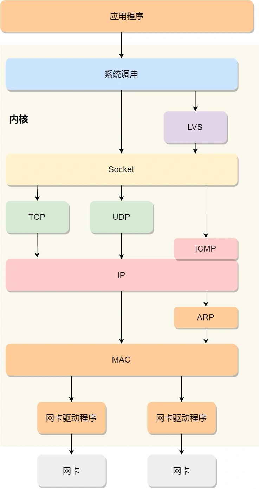
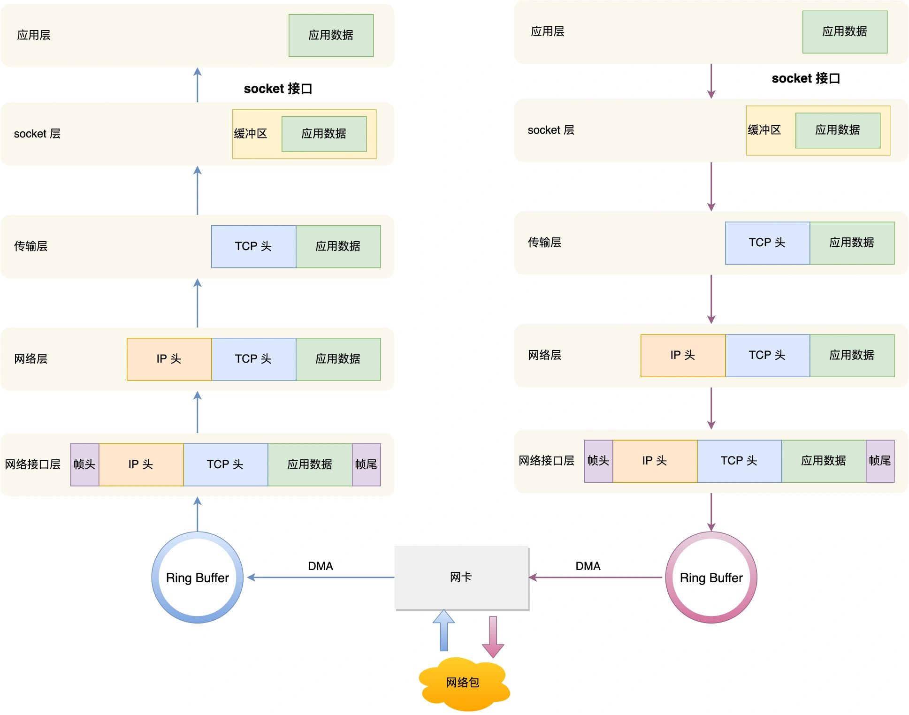

# Linux系统是如何收发网络包的

这是阅读小林coding图解网络系列的笔记，源地址[2.3 Linux 系统是如何收发网络包的？ | 小林coding](https://xiaolincoding.com/network/1_base/how_os_deal_network_package.html#%E7%BD%91%E7%BB%9C%E6%A8%A1%E5%9E%8B)

## OSI网络模型

OSI网络模型（Open System Interconnection Reference Model）分为七层：

- 应用层，负责给应用程序提供统一的接口；
- 表示层，负责把数据转换成兼容另一个系统能识别的格式；
- 会话层，负责建立、管理和终止表示层实体之间的通信会话；
- 传输层，负责端到端的数据传输；
- 网络层，负责数据的路由、转发、分片；
- 数据链路层，负责数据的封帧和差错检测，以及 MAC 寻址；
- 物理层，负责在物理网络中传输数据帧；

OSI模型分层是概念理论上的，没有具体的实现方案。平时比较常见的是四层模型，即TCP/IP网络模型，Linux使用的就是这个模型。

TCP/IP 网络模型共有 4 层：

- 应用层：负责向用户提供一组应用程序，比如 HTTP、DNS、FTP 等;

- 传输层：负责端到端的通信，比如 TCP、UDP 等；

- 网络层：负责网络包的封装、分片、路由、转发，比如 IP、ICMP 等；

- 网络接口层：负责网络包在物理网络中的传输，比如网络包的封帧、 MAC 寻址、差错检测，以及通过网卡传输网络帧等；

## Linux网络协议栈

应用层数据在每一层的封装格式如下图所示：

物理链路并不能传输任意大小的数据包，所以在以太网中，规定了最大传输单元（MTU）是 `1500` 字节，也就是规定了单次传输的最大 IP 包大小。当数据包大小超过MTU时就需要进行分包。

Linux网络协议栈的样子如下图所示：

## Linux接收网络包的流程

接收网络包首先需要有相应的硬件，网卡就是专门负责接收和发送网络包的，当它接收到网络包后，会通过DMA技术把网络包放到Ring Buffer（环形缓冲区）中。

之后需要通知操作系统有网络包到达，最简单的方式就是触发一个中断。

但是网络包的接收可能会非常频繁，频繁地触发中断会引起很大的性能开销，所以Linux内核在2.6版本中采用了NAPI机制，使用中断+轮询的方式来读取数据包。它的核心概念是触发中断不读取数据包，而是用于唤醒数据包接收的服务程序，然后通过poll(轮询)的方式来检查数据包是否全部接收完毕，是的话才一次性读取。

比如，当有网络包到达时，网卡发起硬件中断，于是会执行网卡硬件中断处理函数，**中断处理函数处理完需要「暂时屏蔽中断」，然后唤醒「软中断」来轮询处理数据，直到没有新数据时才恢复中断，这样一次中断处理多个网络包**，于是就可以降低网卡中断带来的性能开销。

## 软中断处理网络包的流程

1. 从 Ring Buffer 中拷贝数据到内核 struct sk_buff 缓冲区

2. 进入到网络接口层，检查报文的合法性，如果不合法则丢弃，合法则会找出该网络包的上层协议的类型，比如是 IPv4，还是 IPv6，接着再去掉帧头和帧尾，然后交给网络层。

3. 到了网络层，则取出 IP 包，判断网络包下一步的走向，比如是交给上层处理还是转发出去。当确认这个网络包要发送给本机后，就会从 IP 头里看看上一层协议的类型是 TCP 还是 UDP，接着去掉 IP 头，然后交给传输层。

4. 传输层取出 TCP 头或 UDP 头，根据四元组「源 IP、源端口、目的 IP、目的端口」 作为标识，找出对应的 Socket，并把数据拷贝到 Socket 的接收缓冲区。
   
   最后，应用层程序调用 Socket 接口，从内核的 Socket 接收缓冲区读取新到来的数据到应用层。

