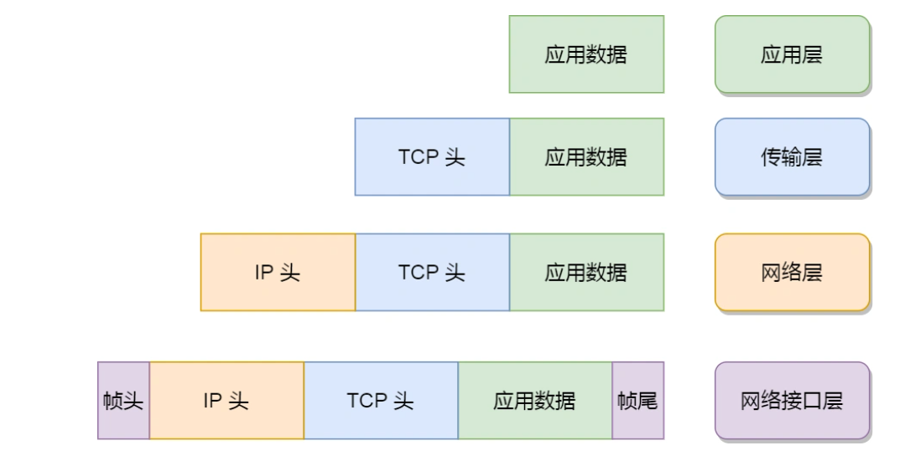

# TCP/IP 网络模型有哪几层？

## 为什么要有 TCP/IP 网络模型？

对于不同设备上的进程间通信，就需要网络通信，而设备是多样性的，所以要兼容多种多样的设备，就协商出了一套**通用的网络协议**。这个网络协议是分层的，每一层都有各自的作用和职责。

## 应用层

应用层是最上层的也是我们能直接接触到的一层。我们电脑或手机使用的应用软件都是在应用层实现。当两个不同设备的应用需要通信的时候，应用就把应用数据传给下一层，也就是传输层。

应用层只需要专注于为用户提供应用功能而不用去关心数据是如何传输的，比如 HTTP、FTP、Telnet、DNS、SMTP等。

应用层是工作在操作系统中的**用户态**，传输层及以下则工作在**内核态**。

## 传输层

应用层的数据包会传给传输层，**传输层****（*Transport Layer*）是**为应用层提供网络支持**的。传输层的设计理念是简单、高效、专注，**并不负责将数据从一个设备传输到另一个设备。**

传输层有两个传输协议，分别是 **TCP 和 UDP。**

- TCP

TCP 的全称叫传输控制协议（*Transmission Control Protocol*），大部分应用使用的正是 TCP 传输层协议，比如 HTTP 应用层协议。TCP 相比 UDP 多了很多特性，比如**流量控制、超时重传、拥塞控制**等，这些都是为了保证数据包能可靠地传输给对方。

- UDP

UDP 相对来说就很简单，简单到只负责发送数据包，不保证数据包是否能抵达对方，但它实时性相对更好，传输效率也高。当然，UDP 也可以实现可靠传输，把 TCP 的特性在应用层上实现就可以，不过要实现一个商用的可靠 UDP 传输协议，也不是一件简单的事情。

- TCP段

当传输层的数据包大小超过 MSS（TCP 最大报文段长度） ，就要将数据包分块，每个分块称为一个 **TCP 段**（*TCP Segment*）。

- 端口号

用于接收方区分一台机器中多个网络通信应用的编号。

80端口：服务器常用

22端口：远程登录服务器常用

浏览器的每个标签栏都是一个独立的进程，操作系统会为这些进程分配临时的端口号。传输层的报文中会携带端口号，因此接收方可以识别出该报文是发送给哪个应用。

## 网络层

- 负责实际的传输功能。

- 最常使用IP协议，把传输层的报文作为数据部分，加上IP包头组成IP报文。

- 如果 IP 报文大小超过 MTU（以太网中一般为 1500 字节）就会**再次进行分片**，得到一个即将发送到网络的 IP 报文。

- IP协议的寻址功能：IP地址

对于 IPv4 协议， IP 地址共 32 位，分成了四段（比如，192.168.100.1），每段是 8 位。

 IP 地址分成两种意义：

- 一个是**网络号**，负责标识该 IP 地址是属于哪个「子网」的；
- 一个是**主机号**，负责标识同一「子网」下的不同主机；

需要配合**子网掩码**才能算出 IP 地址 的网络号和主机号。

比如 10.100.122.0/24，后面的`/24`表示就是 `255.255.255.0` 子网掩码，255.255.255.0 二进制是「11111111-11111111-11111111-00000000」，将它**与IP地址进行按位与运算，得到的前24位就是网络号，后8位就是主机号。**

寻址的过程中，先匹配到相同的网络号（表示要找到同一个子网），才会去找对应的主机。

- IP协议的路由功能

当数据包到达一个网络节点，就需要通过路由算法决定下一步走哪条路径。

所以，**IP 协议的寻址作用是告诉我们去往下一个目的地该朝哪个方向走，路由则是根据「下一个目的地」选择路径。寻址更像在导航，路由更像在操作方向盘**。

## 网络接口层（*Link Layer*）

**作用**

接收来自网络层的IP头部，在 IP 头部的前面加上 MAC 头部，并封装成**数据帧**（Data frame）发送到网络上。

**以太网**

一种在「局域网」内，把附近的设备连接起来，使它们之间可以进行通讯的技术。

MAC 头部是以太网使用的头部，它包含了接收方和发送方的 MAC 地址等信息，我们可以通过 ARP 协议获取对方的 MAC 地址。

**总结**

网络接口层主要为网络层提供「链路级别」传输的服务，负责在以太网、WiFi 这样的底层网络上发送原始数据包，工作在网卡这个层次，使用 MAC 地址来标识网络上的设备。

网络接口层的传输单位是帧（frame），IP 层的传输单位是包（packet），TCP 层的传输单位是段（segment），HTTP 的传输单位则是消息或报文（message）。但这些名词并没有什么本质的区分，可以统称为数据包。
