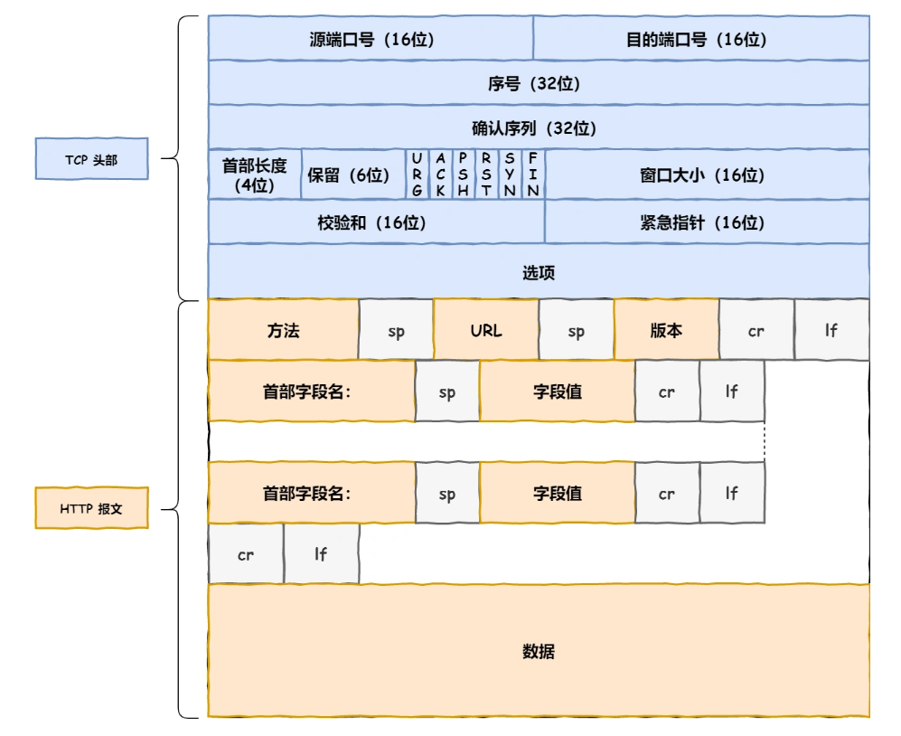
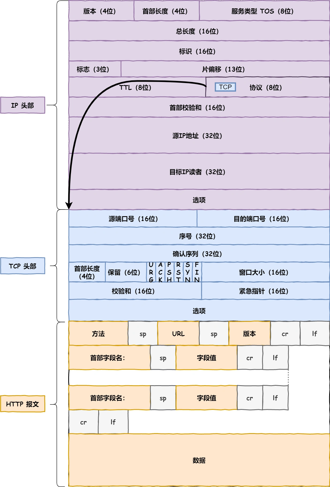
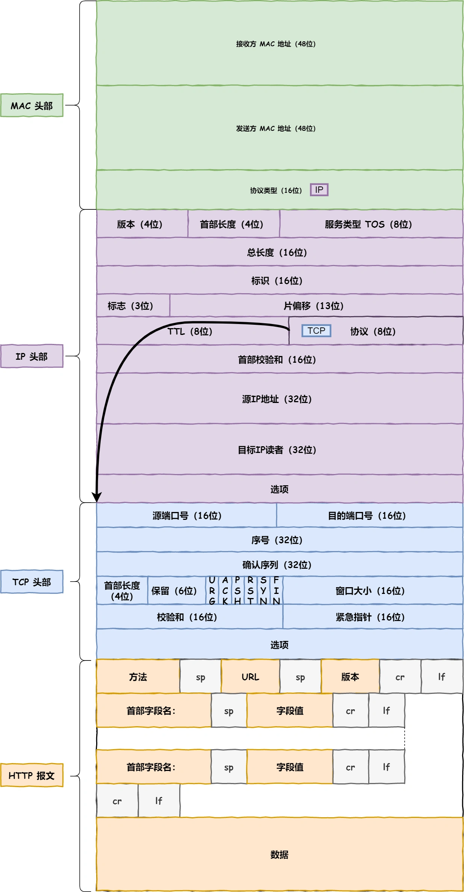
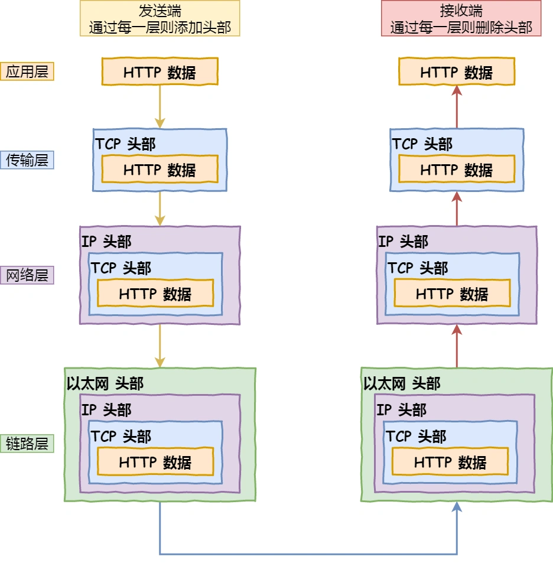

# 键入网址到网页显示，期间发生了什么？

## 

依次发生了以下事情：

- URL的解析

- 生成http消息（报文）

- DNS查询

- 建立TCP连接，生成TCP报文

- 通过IP地址定位

- 通过MAC实现两点传输

## 一、URL解析

URL包括：协议、域名、端口号、路径，代表了服务器里的资源，没有路径的和话会请求默认的文件(index.html或default.html)

## 二、生成HTTP消息

生成请求报文，包括请求行、请求头和请求体。

- 请求行：请求方法、请求URI、协议版本

- 请求头：请求头部及其字段值

- 请求体：数据，GET请求请求体为空。

## 三、DNS查询

查询域名对应的IP地址。

域名：

- 根域：域名最后实际上还有一个点，如`https://server.com.`

- 顶级域：`.com`

域名解析流程：

- 请求客户端TCP/IP设置中的本地DNS服务器地址。

- 接收到请求，如果缓存能找到，就直接返回，找不到就去询问根域名服务器。

- 根DNS接收到请求，指出顶级域名服务器的地址。

- 向顶级域名服务器请求

- 顶级服务器指出权威服务器地址

- 向权威服务器请求

- 权威服务器接收后查询IP地址并返回给本地DNS

- 本地DNS将IP返回客户端

不一定每次域名解析都要请求DNS服务器，浏览器会先看自身有没有对这个域名的缓存，如果有，就直接返回，如果没有，就去问操作系统，操作系统也会去看自己的缓存，如果有，就直接返回，如果没有，再去 hosts 文件看，也没有，才会去问「本地 DNS 服务器」。

## 四、可靠传输——TCP

TCP报文头部组成：

- **源端口号**和**目标端口**号：指出发给哪个应用。

- 包的**序**号：解决包乱序问题。

- **确认号**：解决丢包问题。

- **状态位**
  
  - `SYN` ：发起一个连接
  
  - `ACK` ：回复
  
  - `RST` ：重新连接
  
  - `FIN` :结束连接
  
  TCP 是面向连接的，因而双方要维护连接的状态，这些带状态位的包的发送，会引起双方的状态变更。

- **窗口大小**: 声明通信双方的缓存大小，用于流量控制

HTTP传输数据之前要先建立TCP连接，通常叫做**三次握手**。

- 一开始，客户端和服务端都处于 `CLOSED` 状态。先是服务端主动监听某个端口，处于 `LISTEN` 状态。

- 然后客户端主动发起连接 `SYN`，之后处于 `SYN-SENT` 状态。

- 服务端收到发起的连接，返回 `SYN`，并且 `ACK` 客户端的 `SYN`，之后处于 `SYN-RCVD` 状态。

- 客户端收到服务端发送的 `SYN` 和 `ACK` 之后，发送对 `SYN` 确认的 `ACK`，之后处于 `ESTABLISHED` 状态，因为它一发一收成功了。

- 服务端收到 `ACK` 的 `ACK` 之后，处于 `ESTABLISHED` 状态，因为它也一发一收了。

所以三次握手目的是**保证双方都有发送和接收的能力**。TCP 的连接状态查看，在 Linux 可以通过 `netstat -napt` 命令查看。

生成TCP报文

- `MTU`：一个网络包的最大长度，以太网中一般为 `1500` 字节。
- `MSS`：除去 IP 和 TCP 头部之后，一个网络包所能容纳的 TCP 数据的最大长度。

## 五、远程定位

TCP 模块在执行**连接、收发、断开**等各阶段操作时，都需要委托 IP 模块将数据封装成**网络包**发送给通信对象。

IP报文头部组成：

- 协议：`06`16进制，表示协议为TCP

- 源地址IP

- 目标地址IP

有多个网卡的设备通过路由表来判断使用哪一个网卡：

- 目的IP与子网掩码计算得到网络号和主机号
- 查表中的目标地址，如果有匹配的就是用对应网卡，没有就使用默认网关（目标地址和子网掩码都为0）

## 六、两点传输 —— MAC

在 MAC 包头里需要**发送方 MAC 地址**和**接收方目标 MAC 地址**，用于**两点之间的传输**。

一般在 TCP/IP 通信里，MAC 包头的**协议类型**只使用：

- `0800` ： IP 协议
- `0806` ： ARP 协议

发送方MAC：直接从网卡ROM里读取

接收方MAC:  在以太网中以广播形式询问IP地址归属，对应路由响应。

为了防止每次都要广播， 就要用到**ARP 缓存**：发包时先查缓存，没有再广播。

MAC报文生成：

## 七、出口 —— 网卡

网卡驱动获得网络包后，将其复制到网卡内的缓存区，并在开头加上报头和起始帧分界符，在末尾加上用于检测错误的帧校验序列。然后将数字信号转换为电信号发送出去。

## 八、送别者 —— 交换机

电信号到达网路接口、交换机模块接收并转换为数字信号，判断校验序列没有问题之后放到缓冲区。

在交换机MAC地址表中查询接收方MAC地址，获得对应的端口号，然后将信号发送到该端口号。

MAC地址表找不到就发送到除源端口的其他所有端口。

如果MAC地址是广播地址也会发送到除源端口的其他所有端口，以下两个属于广播地址：

- MAC 地址中的 `FF:FF:FF:FF:FF:FF`
- IP 地址中的 `255.255.255.255`

## 九、出境大门 —— 路由器

- 因为**路由器**是基于 IP 设计的，俗称**三层**网络设备，路由器的各个端口都具有 MAC 地址和 IP 地址；
- 而**交换机**是基于以太网设计的，俗称**二层**网络设备，交换机的端口不具有 MAC 地址。

**包接收**

电信号到达网线接口部分，路由器中的模块会将电信号转成数字信号，然后通过包末尾的 `FCS` 进行错误校验。

如果没问题则检查 MAC 头部中的**接收方 MAC 地址**，看看是不是发给自己的包，如果是就放到接收缓冲区中，否则就丢弃这个包

**查询路由表确定输出端口**

- **去掉**包开头的 MAC 头部。

- 根据 MAC 头部后方的 `IP` 头部中的内容进行包的转发操作。

**路由器的发送操作**

首先根据**路由表的网关列**判断对方的地址：

- 如果网关是一个 IP 地址，**还未抵达终点**，还需继续需要路由器转发。

- 如果网关为空，说明**已抵达终点**。

通过 `ARP` 协议根据 IP 地址查询 MAC 地址

网络包传输的过程中，**源 IP 和目标 IP 始终是不会变的，一直变化的是 MAC 地址**，因为需要 MAC 地址在以太网内进行**两个设备**之间的包传输。

